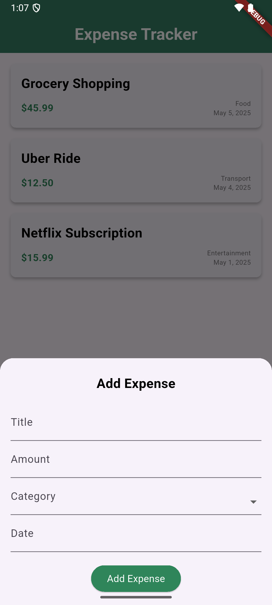
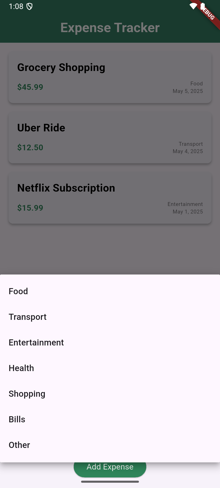
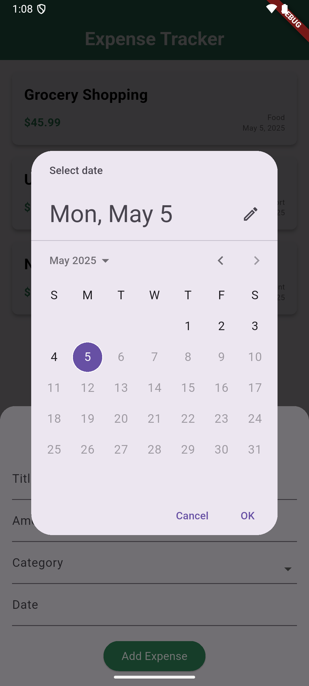
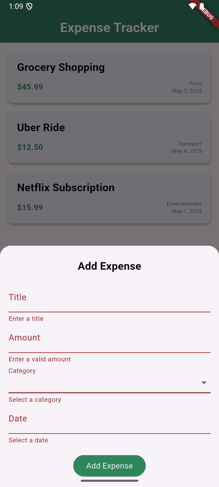
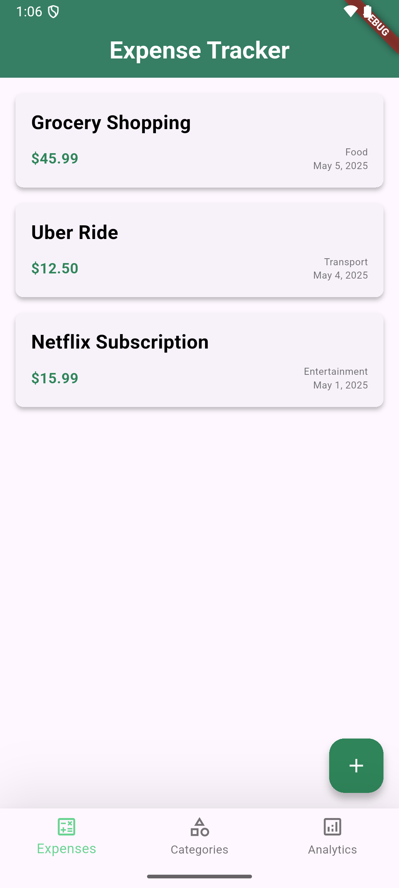
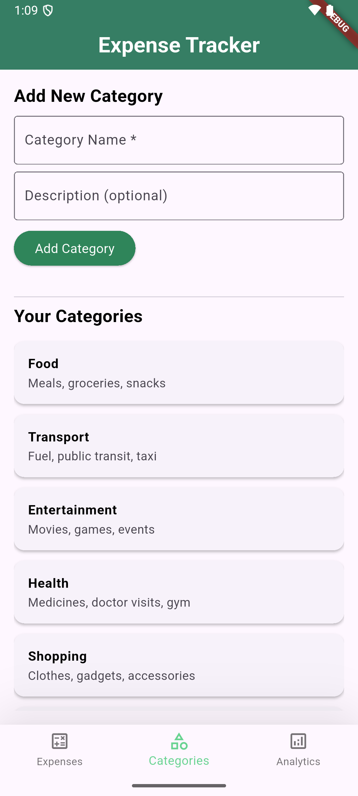
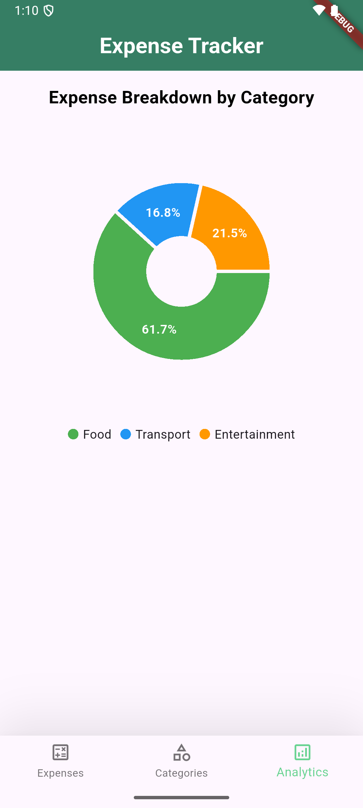

# 💸 Expense Tracker App

A simple yet functional expense tracker app built with **Flutter**. It allows users to add, view, and analyze their expenses based on categories. The project uses a clean and modular design approach, centralizing static data and styling for easy scalability and maintainability.

---

## 🎥 Demo

[Watch the demo video here](https://drive.google.com/file/d/1yXRsle-imLKMBvE-O6gfP05NSBamIPLG/view?usp=sharing)

---

## 🧭 Features

- Add new expenses with validation.
- Select categories and pick custom dates.
- View expenses in a scrollable list.
- Visualize expenses via a pie chart in the Analytics section.
- Maintain a list of categories with optional descriptions.
- Responsive UI with theme and spacing customization.

---

## 🖼️ Screens Overview

### 📝 Add Expense Flow

<table>
  <tr>
    <td></td>
    <td></td>
    <td></td>
    <td></td>
  </tr>
  <tr>
    <td align="center">Expense Form</td>
    <td align="center">Category Dropdown</td>
    <td align="center">Date Picker</td>
    <td align="center">Validation</td>
  </tr>
</table>

---

### 📋 View Expenses

---

### 📂 View Categories

---

### 📊 Analytics

---

## 🔮 Future Scope

Planned improvements (in priority order):

1. **✏️ Edit/Delete Expenses** — Modify or remove existing expenses.
2. **🗂 Edit/Delete Categories** — Manage category list and update descriptions.
3. **💾 Hive DB Integration** — Persistent storage using Hive for offline capability.
4. **📌 Sort and Filter in Expenses** — Sort by date, amount, or filter by category.
5. **📈 Advanced Analytics** — Monthly breakdowns, bar charts, trend lines. 

---

## 🙏 Thanks

Thanks for checking out the project!  
Contributions, feedback, and suggestions are always welcome.
